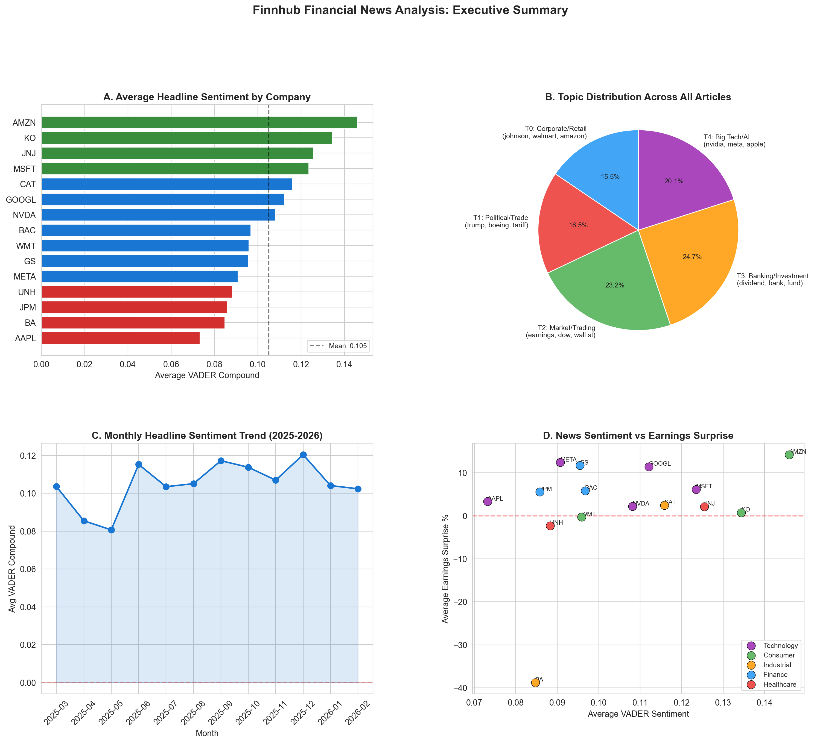
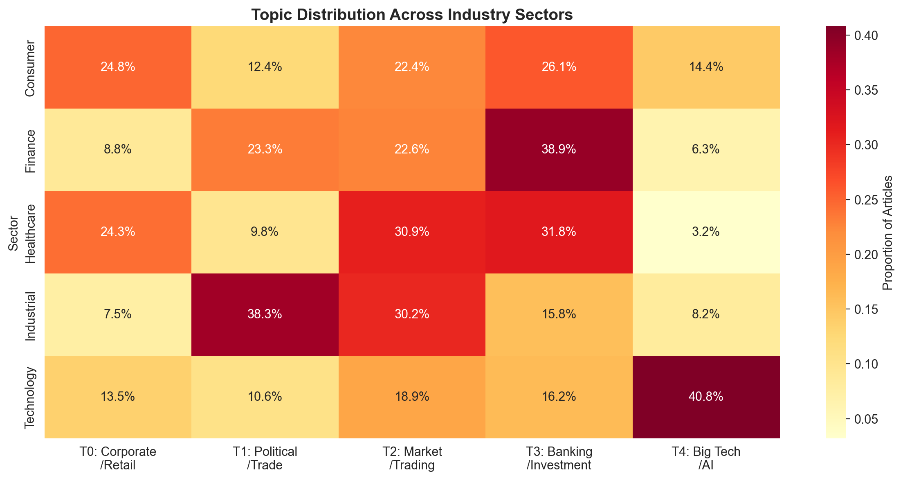
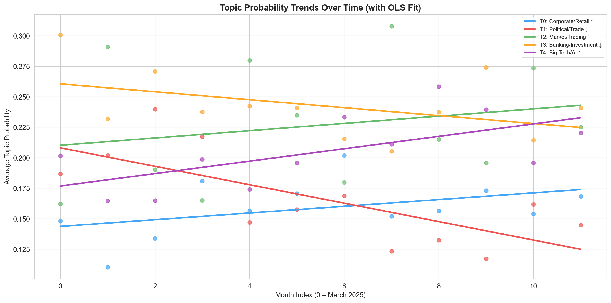
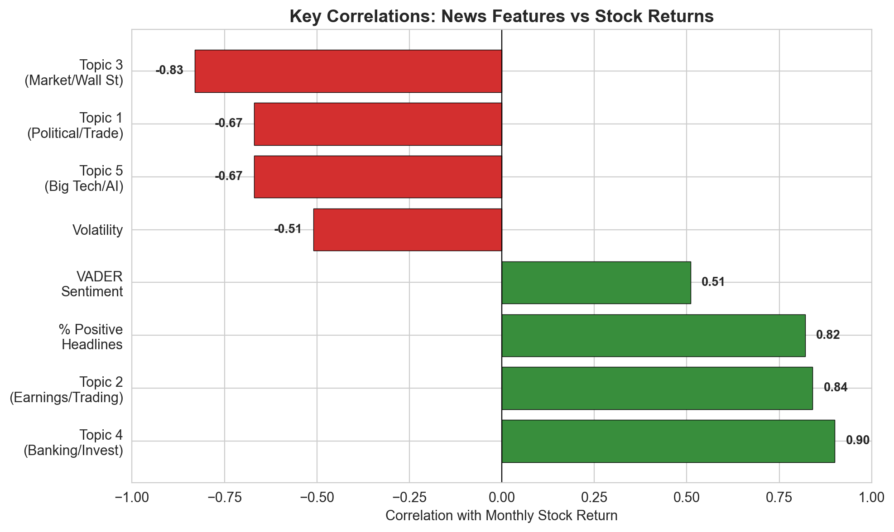

# Decoding Wall Street

**What 40,000 financial news headlines reveal about market sentiment, media narratives, and stock returns.**

---

I started this project with a simple question: does the *language* of financial news tell us something the numbers alone cannot?

Every day, thousands of headlines are written about publicly traded companies. Some are bullish, some are bearish, most are somewhere in between. But beneath that surface, there's structure — recurring topics, shifting narratives, and sentiment patterns that map to real market behavior in ways I didn't fully expect.

This project applies natural language processing to 40,112 Finnhub news articles covering 15 major U.S. companies across 5 sectors over 12 months (March 2025 – February 2026). It combines sentiment analysis, topic modeling, and regression to connect the language of financial media to stock returns and earnings surprises.

The punchline? **What news talks about predicts returns better than whether it sounds positive or negative.** Topic modeling outperformed sentiment analysis as a signal — and that surprised me.

---

## The Companies

| Technology | Finance | Healthcare | Consumer | Industrial |
|:----------:|:-------:|:----------:|:--------:|:----------:|
| AAPL | JPM | JNJ | AMZN | CAT |
| MSFT | GS | UNH | WMT | BA |
| GOOGL | BAC | | KO | |
| META | | | | |
| NVDA | | | | |

---

## What I Did

The project follows a four-stage pipeline, each building on the last.

### 1. Data Collection & EDA

Pulled 40,112 articles from the Finnhub API. Tech companies dominate the news volume — Apple and Nvidia alone account for a disproportionate share. Article counts vary significantly by company, which itself is an interesting signal (more coverage ≠ better performance).

### 2. Text Preprocessing

Standard NLP pipeline: lowercasing, regex cleanup, stopword removal (ISO standard + a custom financial stopword list), and WordNet lemmatization. Then TF-IDF vectorization to extract the most distinctive terms per sector. The TF-IDF results were satisfying — technology articles surface terms like *chip, gpu, ai*, finance surfaces *dividend, loan, banking*, and healthcare pulls *drug, patient, fda*. The vocabulary genuinely reflects the sector.

### 3. Sentiment Analysis

Ran dual scoring with VADER and TextBlob on all 40K+ headlines.

The overall mood: **39.9% positive, 42.6% neutral, 17.4% negative.** Financial news has a mild optimism bias, which is consistent with what prior research has found. Amazon gets the most positive coverage (0.146 average VADER compound), Apple the least (0.073). VADER and TextBlob agree at r = 0.37, moderate but not high — they genuinely capture different things. VADER picks up punctuation, capitalization, and word order. TextBlob averages word-level polarity.

One thing that stood out: sentiment is remarkably stable month to month. No dramatic mood swings across the year. The financial media, at least in aggregate, maintains a pretty steady tone.

### 4. Topic Modeling

LDA with 5 topics, 500 Gibbs sampling iterations, fit on 39,293 preprocessed documents.

The five topics that emerged:

| Topic | Label | Share | Top Words |
|:-----:|:------|:-----:|:----------|
| T0 | Corporate / Retail | 15.5% | johnson, walmart, amazon, launch, business |
| T1 | Political / Trade | 16.5% | trump, boeing, tariff, president, deal |
| T2 | Market / Trading | 23.2% | earnings, dow, wall street, S&P, trading |
| T3 | Banking / Investment | 24.8% | dividend, bank, fund, goldman, sachs |
| T4 | Big Tech / AI | 20.1% | nvidia, meta, apple, alphabet, chip |

These aren't random word clusters. They map to real business domains, and the alignment with sectors is strong: Boeing's coverage is 56% Political/Trade. Nvidia is 48% Big Tech/AI. Goldman Sachs is 36% Banking/Investment. Every sector has a distinct topic fingerprint.

**The narrative is shifting.** OLS regression on topic probabilities over time shows statistically significant trends (all p < 0.001):
- Earnings/Market and Big Tech/AI coverage are **rising** (+0.5%/month each)
- Political/Trade is **declining** (−0.7%/month) — tariff fatigue is real
- Banking/Investment is slowly declining from its dominant position

### 5. Market Impact

This is where I connected NLP features to actual financial outcomes by merging monthly sentiment and topic aggregates with stock return data.

**Correlations with monthly returns:**

| Feature | r |
|:--------|:-:|
| Banking / Investment topic | +0.90 |
| Earnings / Trading topic | +0.84 |
| % Positive headlines | +0.82 |
| VADER mean sentiment | +0.51 |
| Volatility | −0.51 |
| Political / Trade topic | −0.67 |
| Market / Wall Street topic | −0.83 |

The finding that surprised me most: topic probabilities are stronger return predictors than sentiment scores. The Banking/Investment topic correlates at 0.90 with returns — compare that to VADER sentiment at 0.51. *What* news covers matters more than *how* it sounds.

A note on interpretation: these are cross-sectional correlations across 15 companies, so the small sample means the exact magnitudes should be taken directionally rather than as precise estimates.

**Earnings surprises** tell their own story. Boeing is the clear outlier: lowest sentiment, worst surprise at −38%. Amazon sits on the opposite end — highest sentiment, highest positive surprise. But when I looked at whether pre-earnings sentiment *predicts* actual surprises, the correlation was −0.09 — essentially zero. News reacts to earnings. It doesn't predict them. The surprise really is surprising.

### 6. Summary & Visualization

Four polished visualizations synthesizing the full analysis: an executive dashboard, topic-sector heatmap, OLS trend chart, and correlation highlights.

---

## Three Takeaways

**1. Sentiment signals are real.** Positive headlines genuinely correlate with higher returns (r = 0.82). Financial news captures market psychology in a measurable way.

**2. Topics predict more than tone.** This was the surprise. Topic modeling outperforms sentiment as a return predictor. It's not about whether news sounds good or bad — it's about what the news is actually covering.

**3. News reacts, it doesn't predict.** Pre-earnings sentiment has near-zero predictive power (r = −0.09). Markets are efficient. The earnings surprise is truly surprising.

## Tools

`Python` · `Finnhub API` · `NLTK` · `VADER` · `TextBlob` · `scikit-learn` · `statsmodels` · `pandas` · `seaborn` · `matplotlib` · `LDA` · `TF-IDF` · `OLS Regression` · `Mixed Effects Models`

---

## What I'd Do Differently

If I were extending this, three things:

**FinBERT instead of VADER.** VADER is a general-purpose sentiment tool. FinBERT is trained specifically on financial text and understands that "beating expectations" is positive and "restructuring" is negative in ways VADER cannot.

**Weekly aggregation instead of monthly.** Monthly aggregation gave me roughly 12 time points for the OLS regressions, which limits statistical power. Weekly windows would increase the sample substantially.

**Real-time pipeline.** The Finnhub API supports streaming. A production version of this could score incoming headlines in real-time and flag when a company's topic distribution shifts abnormally — that's where the alpha might be.

---
